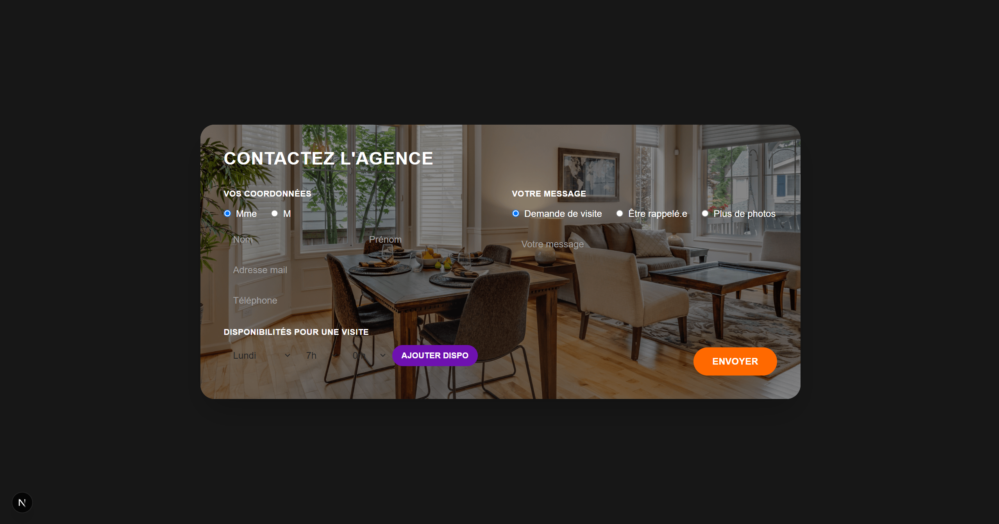
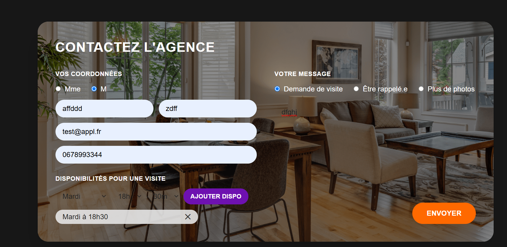
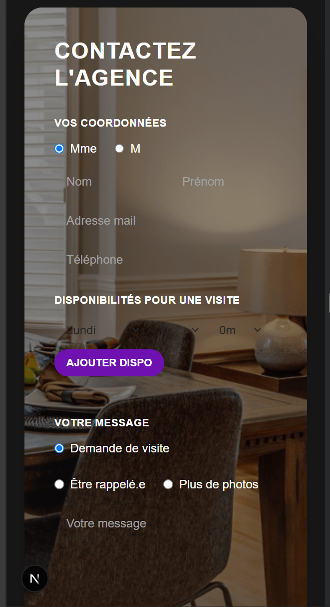

# Test technique — Tremplin

## 👋 À propos de moi

Aymane SARHOU, développeur full stack en Mastère Lead Developer à ITIC Paris. J'ai une expérience concrète en conception d'applications web et mobile sur des projets variés : gestion scolaire, facturation, gestion de stock avec du machine learning. Je travaille aussi bien avec React, Angular, Symfony que Spring Boot, du modèle de données jusqu'au déploiement.

Je suis actuellement à la recherche d'une alternance (rythme 3 semaines entreprise / 1 semaine école) pour rejoindre une équipe sur des projets ambitieux.

## 🖼️ Aperçu du projet

**Formulaire (desktop, vide)**


**Formulaire rempli, avec une disponibilité ajoutée**


**Confirmation après envoi**


**Version mobile (responsive)**


## 🛠️ Stack technique

| Techno | Usage |
|---|---|
| **Next.js (App Router)** | Framework fullstack : je n'ai pas eu besoin de monter un serveur Express séparé, les API routes suffisent pour recevoir et enregistrer les données du formulaire |
| **TypeScript** | Typage sur tout le projet (front, API, modèles) |
| **Tailwind CSS** | Stylisation rapide, cohérente avec l'esprit "maquette" à reproduire précisément |
| **Prisma ORM (v7) + MySQL** | Modélisation relationnelle des données. Prisma 7 utilise désormais un query compiler JS et impose un driver adapter (`@prisma/adapter-mariadb`) plutôt que le moteur Rust historique |
| **Docker Compose** | Base MySQL locale, fournie dans le repo de base |

### Choix de modélisation

Le formulaire permet d'ajouter plusieurs disponibilités (jour/heure/minute) à la volée, façon liste "to-do". J'ai donc modélisé ça avec une relation **one-to-many** (`Contact` → `Disponibilite[]`) plutôt qu'un champ texte ou JSON, pour rester propre en base et profiter des nested writes de Prisma à l'enregistrement.

## 🚀 Lancer le projet en local

**Prérequis** : Node.js 18+, Docker

```bash
# 1. Cloner le repo
git clone https://github.com/aymanesarhou/test-tremplin-aymanesarhou.git
cd test-tremplin-aymanesarhou

# 2. Installer les dépendances
npm install

# 3. Lancer la base MySQL
docker compose up -d

# 4. Copier le fichier d'environnement et l'adapter si besoin
cp .env.example .env

# 5. Appliquer les migrations
npx prisma migrate dev

# 6. Lancer le serveur de développement
npm run dev
```

L'application est disponible sur [http://localhost:3000](http://localhost:3000).

## 💬 Retours sur le test

- Exercice intéressant et bien calibré pour évaluer à la fois l'intégration front (fidélité à la maquette) et la mise en place d'un backend complet avec base de données.
- Petite galère technique : Prisma venait de sortir sa version 7 pendant que je faisais le test, avec un changement de configuration important (driver adapters obligatoires, url déplacée dans `prisma.config.ts`). Pas franchement documenté partout au même endroit, ça m'a pris un peu de temps à stabiliser.
- Ce serait intéressant d'avoir une précision sur le format d'API attendu (REST classique vs GraphQL) si l'exercice devait être étendu à une vraie API découplée du front.